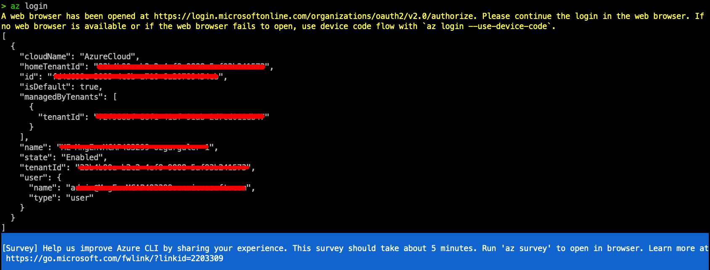

# GETTING STARTED 
In this section we will install the necessary tooling to our PC's...
There are many ways to configure & launch AKS on Azure. Some of which are Azure CLI, Azure Developer CLI, PowerShell, Azure Portal, ARM Templates, Terraform...(For a full list check the [documentation](https://learn.microsoft.com/en-us/azure/aks/learn/quick-kubernetes-deploy-cli)). This workshop uses Azure CLI and kubectl for configuration.

## Install Azure CLI
Follow the latest [MS Learn documentation](https://learn.microsoft.com/en-us/cli/azure/install-azure-cli) to install Azure CLI to your PC.
Login to your azure account by typing "azure login" and login to your account via your browser...

## Install kubectl 
Follow the [kubernetes official documentation](https://kubernetes.io/docs/tasks/tools/install-kubectl-macos/) to install kubectl to your PC. 
