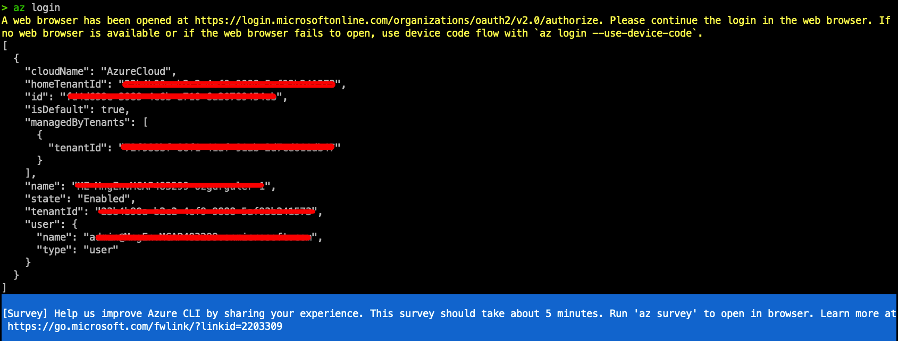
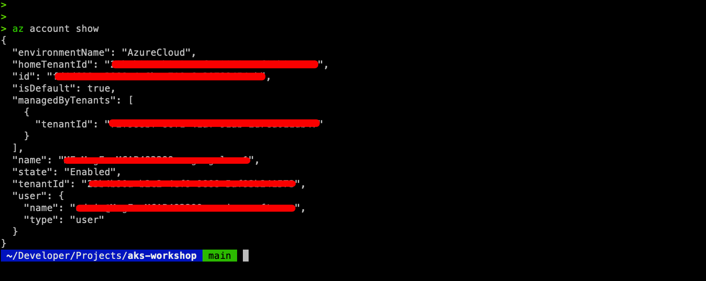
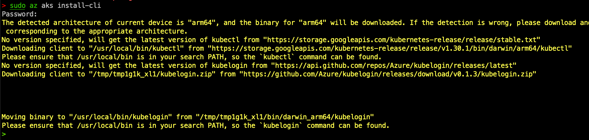

# GETTING STARTED 
In this section we will install the necessary tooling to our PC's...
There are many ways to configure & launch AKS on Azure. Some of which are Azure CLI, Azure Developer CLI, PowerShell, Azure Portal, ARM Templates, Terraform...(For a full list check the [documentation](https://learn.microsoft.com/en-us/azure/aks/learn/quick-kubernetes-deploy-cli)). This workshop uses Azure CLI and kubectl for configuration.

## Install Azure CLI
Follow the latest [MS Learn documentation](https://learn.microsoft.com/en-us/cli/azure/install-azure-cli) to install Azure CLI to your PC.
Login to your azure account by typing "azure login" and login to your account with your browser...


Confirm you have logged in successfully with...

```
az account show 
```


## Install the kubernetes CLI 
You use the Kubernetes CLI, kubectl, to connect to your Kubernetes cluster. If you use the Azure Cloud Shell, kubectl is already installed. If you're running the commands locally on your PC/MAC, you can use the Azure CLI or Azure PowerShell to install kubectl. Use [az aks install-cli](https://learn.microsoft.com/en-us/cli/azure/aks?view=azure-cli-latest#az-aks-install-cli) to download and install kubectl.



Even if you have kubectl, the Azure CLI includes AKS-specific commands (az aks) that you might need. These commands help you create and manage AKS clusters, get credentials for kubectl, and perform other Azure-specific tasks.

az aks install-cli command specifically installs kubectl via the Azure CLI, ensuring that the version is compatible with AKS. 


## Install Helm 

Install Helm by following [Helm Docs](https://helm.sh/docs/intro/install/) 
For MAC use...
```
brew install helm 
```
Confirm helm installation using...
```
helm version 
```


