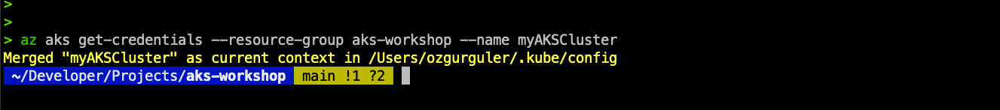

# CREATING an AKS Cluster 

## CREATE an ACR repository 

Azure Container Registry (ACR) is a managed, private Docker registry service that simplifies building, storing, and managing container images for container deployments. ACR allows you to create and maintain Docker container images, which can then be deployed to Azure Kubernetes Service (AKS).

AKS clusters often need to pull container images stored in ACR to run applications. Ensuring that AKS can access ACR is crucial for smooth deployment and scaling of applications.

Integrating ACR with your Continuous Integration/Continuous Deployment (CI/CD) pipeline automates the process of building, testing, and deploying container images:

**Build**: Your CI/CD pipeline can automatically build container images based on your code changes and push these images to ACR.\
**Test**: Automated tests can run on these images to ensure quality and stability. \
**Deploy**: Once validated, the pipeline can deploy them to your AKS cluster. \
This integration ensures that your applications are always up-to-date and that deployments are consistent and reliable.


## Create a resource-group, ACR repo and the AKS Cluster 
A resource group in Azure is a logical container that holds related resources for an Azure solution. It allows you to manage and organize resources such as virtual machines, storage accounts, and databases collectively. Each resource in Azure must be part of a resource group.

Importance of a Resource Group
1. Organization: Resource groups help organize resources in a structured manner, making it easier to manage and locate them.
2. Lifecycle Management: Resources within a resource group can be managed collectively. For example, deleting a resource group will delete all resources contained within it, simplifying cleanup tasks.
3. Access Control: You can apply role-based access control (RBAC) to resource groups, providing specific permissions to users and managing access to the resources within the group.
4. Billing: Costs can be tracked and managed at the resource group level, helping with budget management and cost analysis.

To create and manage resources like Azure Container Registry (ACR) and Azure Kubernetes Service (AKS), you need to specify a resource group. This ensures that these resources are logically grouped together, making it easier to manage, monitor, and secure them.

```sh
az group create --name <ResourceGroupName> --location <Location>
```

e.g. 
```sh
az group create --name aks-workshop --location eastus
```
Then create the acr repo...
```sh
az acr create --resource-group <ResourceGroupName> --name <RegistryName> --sku <SkuTier>
```
e.g.
```sh
az acr create --resource-group aks-workshop --name aksworkshop01 --sku basic
```

Now we can create the AKS cluster...
```sh
az aks create --resource-group aks-workshop --name myAKSCluster --node-count 1 --node-vm-size Standard_B2s --generate-ssh-keys
```

The cluster we have created will have a single node on it. By default AKS nodepools do not scale down to 0. However you can manually scale the node pool to zero using the Azure CLI when required. Here’s how you can do it:
```sh
az aks scale --resource-group aks-workshop --name myAKSCluster --node-count 0
```


## Connect to cluster using kubectl
Configure kubectl to connect to your Kubernetes cluster using the az aks get-credentials command.
```sh
az aks get-credentials --resource-group aks-workshop --name myAKSCluster
```


Check successful operation with kubectl get nodes...
