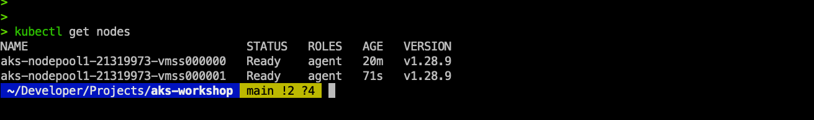

# DEPLOY your First Demo Application

In this section, you will deploy your first application and inspect it using kubectl and later using the Azure portal. Let's start by deploying the application.

Let's first increase the number of nodes in the cluster to 2. (It will take a couple of minutes for the second node to launch...)

```sh
az aks scale --resource-group aks-workshop --name myAKSCluster --node-count 2
```
Confirm the node count increase...
