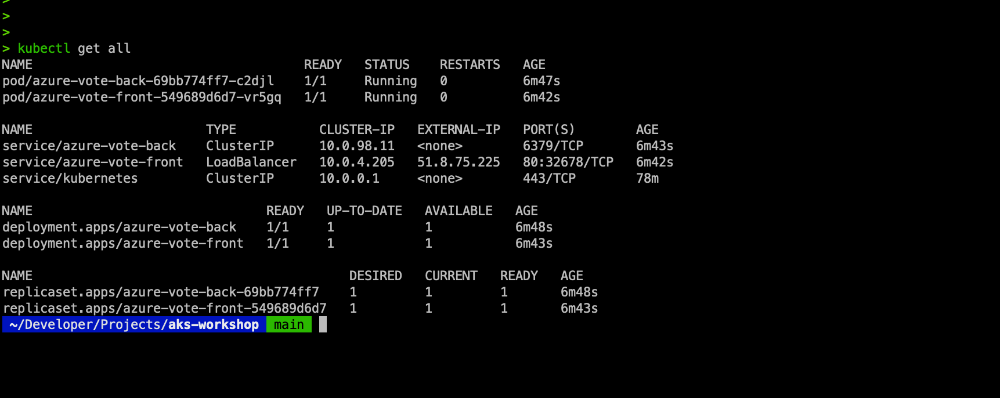

# DEPLOY your First Demo Application

In this section, you will deploy your first application and inspect it using kubectl and later using the Azure portal. Let's start by deploying the application.

Let's first increase the number of nodes in the cluster to 2. (It will take a couple of minutes for the second node to launch...)

```
az aks scale --resource-group aks-workshop --name myAKSCluster --node-count 2
```
Confirm the node count increase...


We will use the *"03azure-vote.yaml"* manifest file in this lab. 
Either download it from under ./code under the github or copy the file contents into a new file locally with the editor of your choice.

## Anatomy of a kubernetes manifest file 
Kubernetes manifest files are essential for defining the desired state of objects deployed within a Kubernetes cluster. These files, typically written in YAML or JSON format, outline various Kubernetes resources, such as pods, deployments, and services. Each manifest file comprises several key sections, each serving a specific purpose in describing the resource configuration. The main sections of a Kubernetes manifest file include apiVersion, kind, metadata, and spec.

### Mandatory Sections
**apiVersion**: This section specifies the version of the Kubernetes API to use for creating the object. It is crucial because it ensures that the resource specification is compatible with the Kubernetes API server. For example, apiVersion: apps/v1 indicates that the resource is using version v1 of the apps API group.

**kind**: The kind field defines the type of Kubernetes resource being described, such as Deployment, Service, or Pod. This information tells Kubernetes what kind of object to create or manage. For instance, kind: Deployment specifies that the resource is a deployment object.

**metadata**: The metadata section provides metadata about the resource, such as its name, namespace, labels, and annotations. At a minimum, the name field is required to uniquely identify the resource within the cluster. Labels are key-value pairs used for organizing and selecting subsets of objects, while annotations are key-value pairs used to store arbitrary metadata. An example of a metadata section is:

**spec**: The spec section describes the desired state of the resource. This section's structure and content vary depending on the type of resource. For example, in a deployment, the spec section includes details about the number of replicas, the selector for identifying pods, and the template for the pod specifications, including container images, resource requests and limits, and ports.

## Example Manifest File
Below is an example Kubernetes manifest file that defines two deployments (azure-vote-back and azure-vote-front) and two services to expose these deployments:

In this section we will deploy an application onto after cluster using the below manifest file...

The provided manifest file defines multiple Kubernetes resources, including two deployments and two services. Here is a detailed breakdown of what each section does:

```sh
apiVersion: apps/v1
kind: Deployment
metadata:
  name: azure-vote-back
spec:
  replicas: 1
  selector:
    matchLabels:
      app: azure-vote-back
  template:
    metadata:
      labels:
        app: azure-vote-back
    spec:
      containers:
      - name: azure-vote-back
        image: redis
        resources:
          requests:
            cpu: 100m
            memory: 128Mi
          limits:
            cpu: 250m
            memory: 256Mi
        ports:
        - containerPort: 6379
          name: redis
---
apiVersion: v1
kind: Service
metadata:
  name: azure-vote-back
spec:
  ports:
  - port: 6379
  selector:
    app: azure-vote-back
---
apiVersion: apps/v1
kind: Deployment
metadata:
  name: azure-vote-front
spec:
  replicas: 1
  selector:
    matchLabels:
      app: azure-vote-front
  template:
    metadata:
      labels:
        app: azure-vote-front
    spec:
      containers:
      - name: azure-vote-front
        image: mcr.microsoft.com/azuredocs/azure-vote-front:v1
        resources:
          requests:
            cpu: 100m
            memory: 128Mi
          limits:
            cpu: 250m
            memory:
```


### Kubernetes Manifest File Explanation

#### 1. Deployment for Backend (Redis)

```yaml
apiVersion: apps/v1
kind: Deployment
metadata:
  name: azure-vote-back
spec:
  replicas: 1
  selector:
    matchLabels:
      app: azure-vote-back
  template:
    metadata:
      labels:
        app: azure-vote-back
    spec:
      containers:
      - name: azure-vote-back
        image: redis
        resources:
          requests:
            cpu: 100m
            memory: 128Mi
          limits:
            cpu: 250m
            memory: 256Mi
        ports:
        - containerPort: 6379
          name: redis
```

The manifest file begins with the apiVersion: apps/v1, which specifies the API version for the deployment. The kind: Deployment indicates that this is a **Deployment object**, managing a set of replicas of a pod. Under metadata, the name: azure-vote-back names the Deployment "azure-vote-back".

In the spec section, replicas: 1 specifies that one replica of the pod should be running. The selector section with matchLabels: app: azure-vote-back matches pods with the label "app: azure-vote-back". Within the template section, under metadata, the labels: app: azure-vote-back labels the pod with "app: azure-vote-back".

Further in the spec section, containers defines the containers within the pod. The name: azure-vote-back names the container "azure-vote-back", and image: redis uses the Redis image. The resources section specifies resource requests and limits for the container: requests for cpu: 100m (100 milliCPU) and memory: 128Mi (128 MiB of memory), and limits for cpu: 250m (250 milliCPU) and memory: 256Mi (256 MiB of memory). Finally, the ports section exposes the container port, with containerPort: 6379 exposing port 6379 and name: redis naming the port "redis".

#### 2. Service for Backend
```yaml
apiVersion: v1
kind: Service
metadata:
  name: azure-vote-back
spec:
  ports:
  - port: 6379
  selector:
    app: azure-vote-back
```
The manifest file specifies the apiVersion: v1, indicating the API version for the service. The kind: Service denotes that this is a Service object, providing network access to a set of pods. Under metadata, the name: azure-vote-back names the Service "azure-vote-back".

In the spec section, the ports section specifies port: 6379, exposing port 6379. The selector section with app: azure-vote-back selects pods with the label "app: azure-vote-back".

#### 3. Deployment for Frontend
```yaml
apiVersion: apps/v1
kind: Deployment
metadata:
  name: azure-vote-front
spec:
  replicas: 1
  selector:
    matchLabels:
      app: azure-vote-front
  template:
    metadata:
      labels:
        app: azure-vote-front
    spec:
      containers:
      - name: azure-vote-front
        image: mcr.microsoft.com/azuredocs/azure-vote-front:v1
        resources:
          requests:
            cpu: 100m
            memory: 128Mi
          limits:
            cpu: 250m
            memory: 256Mi
```

The manifest file specifies the apiVersion: apps/v1, indicating the API version for the deployment. The kind: Deployment denotes that this is a Deployment object. Under metadata, the name: azure-vote-front names the Deployment "azure-vote-front".

In the spec section, replicas: 1 specifies that one replica of the pod should be running. The selector section with matchLabels: app: azure-vote-front matches pods with the label "app: azure-vote-front". Within the template section, under metadata, the labels: app: azure-vote-front labels the pod with "app: azure-vote-front".

Further in the spec section, containers defines the containers within the pod. The name: azure-vote-front names the container "azure-vote-front", and image: mcr.microsoft.com/azuredocs/azure-vote-front:v1 uses the specified image for the frontend. The resources section specifies resource requests and limits for the container: requests for cpu: 100m (100 milliCPU) and memory: 128Mi (128 MiB of memory), and limits for cpu: 250m (250 milliCPU) and memory: 256Mi (256 MiB of memory).

## Deploying the App 

Now download the .yaml manifest file and deploy the app onto your cluster. \
First download the azure-vote.yaml file from under ./code and deploy the app using...

*(Either download 03azure-vote.yaml under ./code or copy the contents in to a local path where you will run the kubectl create command.)*
```
kubectl create -f 03azure-vote.yaml
```

You should see the below if the deployment is successful!


Type the following command to get the public IP of the load balancer:


Now, open the browser and access the external IP address of the load balancer...


Confirm the app works, by pression on the voting buttons.

To see all the objects in Kubernetes that were created for your application, you can use the kubectl get all command.


As you can see, a number of objects were created:

**Pods**: You will see two pods, one for the back end and one for the front end. \
**Services**: You will also see two services, one for the back end of type ClusterIP and one for the front end of type LoadBalancer.  deployment on AKS. \
**Deployments**: You will also see two deployments. \
**ReplicaSets**: And finally you'll see two ReplicaSets. \

You can also view these objects from the Azure portal. To see, for example, the two deployments, you can click on Workloads in the left-hand navigation menu of the AKS pane, and you will see all the deployments in your cluster. This figure shows you all the deployments in your cluster, including the system deployments. At the bottom of the list, you can see your own deployments. As you can also see in this figure, you can explore other objects such as pods and ReplicaSets using the top menu:


Before moving on to the next chapter, let's clean up your deployment. Since you created everything from a file, you can also delete everything by pointing Kubernetes to that file. Type: 

```
kubectl delete -f azure-vote.yaml 
```
and watch all your objects get deleted.

