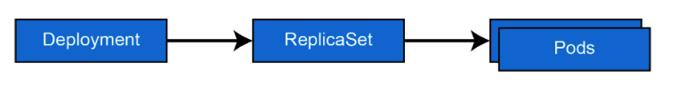
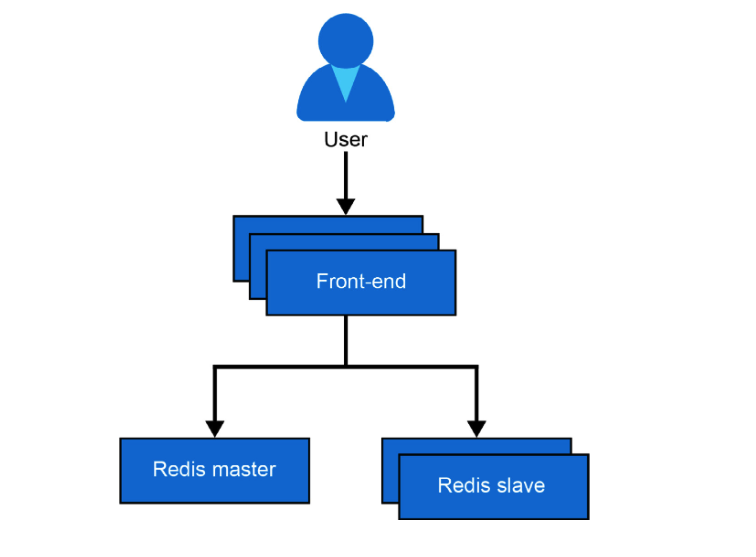
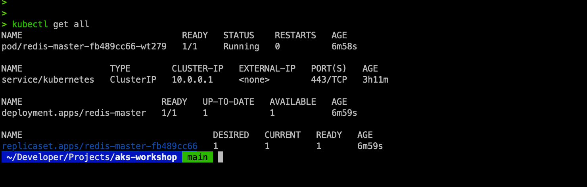

# Application Deployment 

In this chapter, you will deploy the classic guestbook sample Kubernetes application. You will be mostly following the steps from https://kubernetes.io/docs/tutorials/stateless-application/guestbook/ with some modifications. You will employ these modifications to show additional concepts, such as ConfigMaps, that are not present in the original sample.

The sample guestbook application is a simple, multi-tier web application. The different tiers in this application will have multiple instances. This is beneficial for both high availability and scalability. The guestbook's front end is a stateless application because the front end doesn't store any state. The Redis cluster in the back end is stateful as it stores all the guestbook entries.

## Overview

An application consists of multiple parts, and you will build the applications one step at a time while the conceptual model behind them is explained. You will be able to easily adapt the steps in this chapter to deploy any other application on AKS.

Kubernetes, often abbreviated as K8s, is an open-source platform designed to automate the deployment, scaling, and operation of application containers. Three fundamental concepts in Kubernetes are Deployments, ReplicaSets, and Pods. These components are essential for managing and orchestrating containerized applications effectively.




[**Pods**](https://kubernetes.io/docs/concepts/workloads/pods/) \
...are the smallest and simplest Kubernetes object, a Pod represents a single instance of a running process in your cluster. Think of a Pod as a logical host for one or more containers that share the same network namespace and storage.

Each Pod contains one or more containers (e.g., Docker containers) that share storage, network, and a specification for how to run the containers. Pods are the atomic units that Kubernetes manages.

[**ReplicaSets**](https://kubernetes.io/docs/concepts/workloads/controllers/replicaset/) \
A ReplicaSet ensures that a specified number of Pod replicas are running at any given time. It’s the key to ensuring your application has the correct number of instances running.

Replicasets maintains the desired number of Pods by creating or deleting them as needed. If a Pod fails or is terminated, the ReplicaSet automatically creates a new Pod to replace it, ensuring high availability and reliability.

Imagine you have a web application that needs to handle a certain amount of traffic. A ReplicaSet can ensure that the right number of instances (Pods) are always running to handle the load.

[**Deployments**](https://kubernetes.io/docs/concepts/workloads/controllers/deployment/) \
A Deployment provides declarative updates to Pods and ReplicaSets. It manages the deployment of applications by creating ReplicaSets to ensure that the correct number of Pods are running.

Deployments handle the lifecycle of an application, including rolling updates, rollbacks, and scaling. You can use Deployments to upgrade your application seamlessly without downtime by gradually replacing old Pods with new ones.

For instance, if you need to update your web application to a new version, a Deployment can handle this smoothly by creating a new ReplicaSet and transitioning from the old version to the new one.

**Relationships** \
*Pods are managed by ReplicaSets:* A ReplicaSet ensures that the desired number of Pods are running. It monitors the health of Pods and replaces them if they fail.
Deployments manage ReplicaSets: A Deployment creates and manages ReplicaSets to ensure that the correct number of Pods are running. It simplifies the process of updating and scaling applications by abstracting the underlying ReplicaSets.
Rolling Updates Example
*Deployment:* Initiates the rolling update process.
*Old ReplicaSet:* Gradually phased out as the new ReplicaSet is scaled up.
*New ReplicaSet:* Created and scaled up to take over from the old one.
*Pods:* Transition from the old ReplicaSet to the new one, ensuring zero downtime.
This architecture ensures that your application remains available and reliable while updates are applied without interruption.


## Introducing the Application 

The application stores and displays guestbook entries. You can use it to record the opinion of all the people who visit your hotel or restaurant, for example.

Below figure shows you a high-level overview of the application. The application uses PHP as a front end. The front end will be deployed using multiple replicas. The application uses Redis for its data storage. Redis is an in-memory key-value database. Redis is most often used as a cache.




We will begin deploying this application by deploying the Redis master.

## Deploying the Redis master
Download 04redis-master-deployment.yaml from under code...

```sh
kubectl apply -f 04redis-master-deployment.yaml.yaml
```

```yaml
1   apiVersion: apps/v1
2   kind: Deployment
3   metadata:
4     name: redis-master
5     labels:
6       app: redis
7   spec:
8     selector:
9       matchLabels:
10        app: redis
11        role: master
12        tier: backend
13    replicas: 1
14    template:
15      metadata:
16        labels:
17          app: redis
18          role: master
19          tier: backend
20      spec:
21        containers:
22        - name: master
23          image: k8s.gcr.io/redis:e2e
24          resources:
25            requests:
26              cpu: 100m
27              memory: 100Mi
28            limits:
29              cpu: 250m
30              memory: 1024Mi
31          ports:
32          - containerPort: 6379
```
Let's dive deeper into the code line by line to understand the provided parameters:

Line 2: This states that we are creating a deployment. As explained in Chapter 1, Introduction to containers and Kubernetes, a deployment is a wrapper around pods that makes it easy to update and scale pods.

Lines 4-6: Here, the deployment is given a name, which is redis-master.

Lines 7-12: These lines let us specify the containers that this deployment will manage. In this example, the deployment will select and manage all containers for which labels match (app: redis, role: master, and tier: backend). The preceding label exactly matches the labels provided in lines 14-19.

Line 13: This line tells Kubernetes that we need exactly one copy of the running Redis master. This is a key aspect of the declarative nature of Kubernetes. You provide a description of the containers your applications need to run (in this case, only one replica of the Redis master), and Kubernetes takes care of it.

Lines 14-19: These lines add labels to the running instance so that it can be grouped and connected to other pods. We will discuss them later to see how they are used.

Line 22: This line gives the single container in the pod a name, which is master. In the case of a multi-container pod, each container in a pod requires a unique name.

Line 23: This line indicates the container image that will be run. In this case, it is the redis image tagged with e2e (the latest Redis image that successfully passed its end-to-end [e2e] tests).

Lines 24-30: These lines set the CPU/memory resources requested for the container. A request in Kubernetes is a reservation of resources that cannot be used by other pods. If those resources are not available in the cluster, the pod will not start. In this case, the request is 0.1 CPU, which is equal to 100m and is also often referred to as 100 millicores. The memory requested is 100Mi, or 104,857,600 bytes, which is equal to ~105 MB. CPU and memory limits are set in a similar way. Limits are caps on what a container can use. If your pod hits the CPU limit, it'll get throttled, whereas if it hits the memory limits, it'll get restarted. Setting requests and limits is a best practice in Kubernetes. For more info, refer to Kubernetes Documentation.

Lines 31-32: These two lines indicate that the container is going to listen on port 6379.

The Kubernetes YAML definition is similar to the arguments given to Docker to run a particular container image. If you had to run this manually, you would define this example in the following way:

**Run a container named master, listening on port 6379, with 100M memory and 100m CPU using the redis:e2e image.**

```sh
docker run --name master -p 6379:6379 -m 100M -c 100m -d k8s.gcr.io/redis:e2e
```
In this section, you have deployed the Redis master and learned about the syntax of the YAML file that was used to create this deployment. In the next section, you will examine the deployment and learn about the different elements that were created.

## Examining the deployment

The redis-master deployment should be complete by now. Continue in the Azure Cloud Shell that you opened in the previous section and type the following:

```sh
kubectl get all
```

You should get an output similar to the one displayed below. In your case, the name of the pod and the ReplicaSet might contain different IDs at the end of the name. If you do not see a pod, a deployment, and a ReplicaSet, please run the code as explained in step 4 in the previous section again.


