# Application Deployment 

In this chapter, you will deploy the classic guestbook sample Kubernetes application. You will be mostly following the steps from https://kubernetes.io/docs/tutorials/stateless-application/guestbook/ with some modifications. You will employ these modifications to show additional concepts, such as ConfigMaps, that are not present in the original sample.

The sample guestbook application is a simple, multi-tier web application. The different tiers in this application will have multiple instances. This is beneficial for both high availability and scalability. The guestbook's front end is a stateless application because the front end doesn't store any state. The Redis cluster in the back end is stateful as it stores all the guestbook entries.

## Overview

An application consists of multiple parts, and you will build the applications one step at a time while the conceptual model behind them is explained. You will be able to easily adapt the steps in this chapter to deploy any other application on AKS.

Kubernetes, often abbreviated as K8s, is an open-source platform designed to automate the deployment, scaling, and operation of application containers. Three fundamental concepts in Kubernetes are Deployments, ReplicaSets, and Pods. These components are essential for managing and orchestrating containerized applications effectively.


[**Pods**](https://kubernetes.io/docs/concepts/workloads/pods/) \
...are the smallest and simplest Kubernetes object, a Pod represents a single instance of a running process in your cluster. Think of a Pod as a logical host for one or more containers that share the same network namespace and storage.

Each Pod contains one or more containers (e.g., Docker containers) that share storage, network, and a specification for how to run the containers. Pods are the atomic units that Kubernetes manages.

[**ReplicaSets**](https://kubernetes.io/docs/concepts/workloads/controllers/replicaset/) \
A ReplicaSet ensures that a specified number of Pod replicas are running at any given time. It’s the key to ensuring your application has the correct number of instances running.

Replicasets maintains the desired number of Pods by creating or deleting them as needed. If a Pod fails or is terminated, the ReplicaSet automatically creates a new Pod to replace it, ensuring high availability and reliability.

Imagine you have a web application that needs to handle a certain amount of traffic. A ReplicaSet can ensure that the right number of instances (Pods) are always running to handle the load.

[**Deployments**](https://kubernetes.io/docs/concepts/workloads/controllers/deployment/) \
A Deployment provides declarative updates to Pods and ReplicaSets. It manages the deployment of applications by creating ReplicaSets to ensure that the correct number of Pods are running.

Deployments handle the lifecycle of an application, including rolling updates, rollbacks, and scaling. You can use Deployments to upgrade your application seamlessly without downtime by gradually replacing old Pods with new ones.

For instance, if you need to update your web application to a new version, a Deployment can handle this smoothly by creating a new ReplicaSet and transitioning from the old version to the new one.

**Relationships** \
*Pods are managed by ReplicaSets:* A ReplicaSet ensures that the desired number of Pods are running. It monitors the health of Pods and replaces them if they fail.
Deployments manage ReplicaSets: A Deployment creates and manages ReplicaSets to ensure that the correct number of Pods are running. It simplifies the process of updating and scaling applications by abstracting the underlying ReplicaSets.
Rolling Updates Example
*Deployment:* Initiates the rolling update process.
*Old ReplicaSet:* Gradually phased out as the new ReplicaSet is scaled up.
*New ReplicaSet:* Created and scaled up to take over from the old one.
*Pods:* Transition from the old ReplicaSet to the new one, ensuring zero downtime.
This architecture ensures that your application remains available and reliable while updates are applied without interruption.


## Introducing the Application 

The application stores and displays guestbook entries. You can use it to record the opinion of all the people who visit your hotel or restaurant, for example.

Below figure shows you a high-level overview of the application. The application uses PHP as a front end. The front end will be deployed using multiple replicas. The application uses Redis for its data storage. Redis is an in-memory key-value database. Redis is most often used as a cache.


We will begin deploying this application by deploying the Redis master.

## Deploying the Redis master
Download 04redis-master-deployment.yaml from under code...

```sh
kubectl apply -f 04redis-master-deployment.yaml.yaml
```

```yaml
1   apiVersion: apps/v1
2   kind: Deployment
3   metadata:
4     name: redis-master
5     labels:
6       app: redis
7   spec:
8     selector:
9       matchLabels:
10        app: redis
11        role: master
12        tier: backend
13    replicas: 1
14    template:
15      metadata:
16        labels:
17          app: redis
18          role: master
19          tier: backend
20      spec:
21        containers:
22        - name: master
23          image: k8s.gcr.io/redis:e2e
24          resources:
25            requests:
26              cpu: 100m
27              memory: 100Mi
28            limits:
29              cpu: 250m
30              memory: 1024Mi
31          ports:
32          - containerPort: 6379
```
Let's dive deeper into the code line by line to understand the provided parameters:

Line 2: This states that we are creating a deployment. As explained in Chapter 1, Introduction to containers and Kubernetes, a deployment is a wrapper around pods that makes it easy to update and scale pods.

Lines 4-6: Here, the deployment is given a name, which is redis-master.

Lines 7-12: These lines let us specify the containers that this deployment will manage. In this example, the deployment will select and manage all containers for which labels match (app: redis, role: master, and tier: backend). The preceding label exactly matches the labels provided in lines 14-19.

Line 13: This line tells Kubernetes that we need exactly one copy of the running Redis master. This is a key aspect of the declarative nature of Kubernetes. You provide a description of the containers your applications need to run (in this case, only one replica of the Redis master), and Kubernetes takes care of it.

Lines 14-19: These lines add labels to the running instance so that it can be grouped and connected to other pods. We will discuss them later to see how they are used.

Line 22: This line gives the single container in the pod a name, which is master. In the case of a multi-container pod, each container in a pod requires a unique name.

Line 23: This line indicates the container image that will be run. In this case, it is the redis image tagged with e2e (the latest Redis image that successfully passed its end-to-end [e2e] tests).

Lines 24-30: These lines set the CPU/memory resources requested for the container. A request in Kubernetes is a reservation of resources that cannot be used by other pods. If those resources are not available in the cluster, the pod will not start. In this case, the request is 0.1 CPU, which is equal to 100m and is also often referred to as 100 millicores. The memory requested is 100Mi, or 104,857,600 bytes, which is equal to ~105 MB. CPU and memory limits are set in a similar way. Limits are caps on what a container can use. If your pod hits the CPU limit, it'll get throttled, whereas if it hits the memory limits, it'll get restarted. Setting requests and limits is a best practice in Kubernetes. For more info, refer to Kubernetes Documentation.

Lines 31-32: These two lines indicate that the container is going to listen on port 6379.

The Kubernetes YAML definition is similar to the arguments given to Docker to run a particular container image. If you had to run this manually, you would define this example in the following way:

**Run a container named master, listening on port 6379, with 100M memory and 100m CPU using the redis:e2e image.**

*You do not need to run this docker command. This is to explain what the manifest file is asking k8s api-server to do!*
```sh
docker run --name master -p 6379:6379 -m 100M -c 100m -d k8s.gcr.io/redis:e2e
```
In this section, you have deployed the Redis master and learned about the syntax of the YAML file that was used to create this deployment. In the next section, you will examine the deployment and learn about the different elements that were created.

## Examining the deployment

The redis-master deployment should be complete by now. Continue in the Azure Cloud Shell that you opened in the previous section and type the following:

```sh
kubectl get all
```

You should get an output similar to the one displayed below. In your case, the name of the pod and the ReplicaSet might contain different IDs at the end of the name. If you do not see a pod, a deployment, and a ReplicaSet, please run the code as explained in step 4 in the previous section again.


You can see that you created a deployment named redis-master. It controls a ReplicaSet named redis-master-fb489cc66. On further examination, you will also find that the ReplicaSet is controlling a pod, redis-master-fb489cc66-wt279. 

More details can be obtained by executing the "kubectl describe <object> <instance-name>" command, as follows:

```sh
kubectl describe deployment/redis-master
```


## Exposing the Redis master service

**Kubernetes Service:**

A Kubernetes Service is an abstraction that defines a logical set of Pods and a policy by which to access them. Services enable communication between different parts of your application and with external users, providing stable endpoints and load balancing for Pods.

**Why Services are Required:**

1. **Stable Networking:** Pods in Kubernetes are ephemeral; they can be created and destroyed dynamically, leading to changes in their IP addresses. Services provide a stable IP address and DNS name, ensuring that clients can reliably connect to the Pods, regardless of their individual IP addresses.

2. **Load Balancing:** Services automatically distribute traffic across the set of Pods they are targeting. This load balancing ensures efficient use of resources and high availability of the application.

3. **Service Discovery:** Kubernetes Services offer built-in service discovery mechanisms. Applications can discover and connect to other services using their DNS names, simplifying the configuration and integration of microservices.

4. **Decoupling Components:** By using Services, different components of an application can be decoupled. Each component can communicate with others through well-defined interfaces, making it easier to scale, manage, and update individual parts without affecting the entire system.

5. **External Access:** Services can expose your applications to external users. For example, a Service of type `LoadBalancer` can provision an external IP address, enabling access from outside the Kubernetes cluster.

**Types of Services:**

1. **ClusterIP:** The default type, which exposes the Service on an internal IP in the cluster. This type makes the Service only accessible within the cluster.

2. **NodePort:** Exposes the Service on the same port of each selected Node in the cluster, making it accessible from outside the cluster using `<NodeIP>:<NodePort>`.

3. **LoadBalancer:** Creates an external load balancer (if supported by the cloud provider) and assigns a fixed external IP to the Service, making it accessible from outside the cluster.

4. **ExternalName:** Maps a Service to the contents of the `externalName` field (e.g., `example.com`), returning a CNAME record with the name.


**Example Usage:**

```yaml
apiVersion: v1
kind: Service
metadata:
  name: my-service
spec:
  selector:
    app: my-app
  ports:
    - protocol: TCP
      port: 80
      targetPort: 9376
  type: ClusterIP

```yaml
apiVersion: v1
kind: Service
metadata:
  name: redis-master
  labels:
    app: redis
    role: master
    tier: backend
spec:
  ports:
  - port: 6379
    targetPort: 6379
  selector:
    app: redis
    role: master
    tier: backend
```

Deploy the manifest file with ...

```
kubectl apply -f 04redis-master-service.yaml
```

The redis-master-service.yaml file has the following content:

1   apiVersion: v1

2   kind: Service

3   metadata:

4     name: redis-master

5     labels:

6       app: redis

7       role: master

8       tier: backend

9   spec:

10   ports:

11   - port: 6379

12     targetPort: 6379

13    selector:

14      app: redis

15      role: master

16      tier: backend

Let's now see what you have created using the preceding code:

Lines 1-8: These lines tell Kubernetes that we want a service called redis-master, which has the same labels as our redis-master server pod.

Lines 10-12: These lines indicate that the service should handle traffic arriving at port 6379 and forward it to port 6379 of the pods that match the selector defined between lines 13 and 16.

Lines 13-16: These lines are used to find the pods to which the incoming traffic needs to be sent. So, any pod with labels matching (app: redis, role: master and tier: backend) is expected to handle port 6379 traffic. If you look back at the previous example, those are the exact labels we applied to that deployment.

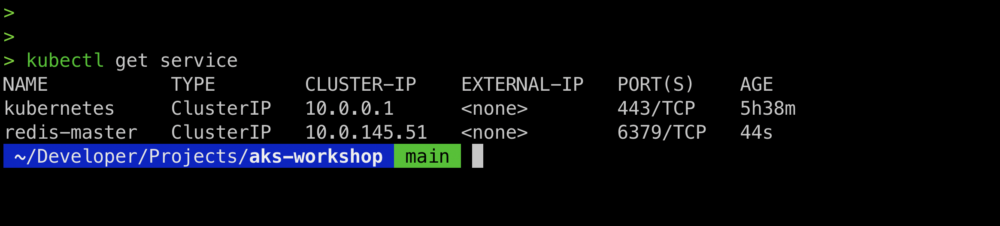

You see that a new service, named redis-master, has been created. It has a Cluster-IP of 10.0.145.51 (in your case, the IP will likely be different). Note that this IP will work only within the cluster (hence the ClusterIP type).

A service also introduces a Domain Name Server (DNS) name for that service. The DNS name is of the form <service-name>.<namespace>.svc.cluster.local; in this case, it would be redis-master.default.svc.cluster.local. To see this in action, we'll do a name resolution on our redis-master pod. The default image doesn't have nslookup installed, so we'll bypass that by running a ping command. Don't worry if that traffic doesn't return; this is because you didn't expose ping on your service, only the redis port. The command is, however, useful to see the full DNS name and the name resolution work. Let's have a look:

```
kubectl get pods

#note the name of your redis-master pod

kubectl exec -it redis-master-<pod-id> -- bash

ping redis-master
```

This should output the resulting name resolution, showing you the Fully Qualified Domain Name (FQDN) of your service and the IP address that showed up earlier. You can stop the ping command from running by pressing Ctrl+C. You can exit the pod via the exit command, as shown below...

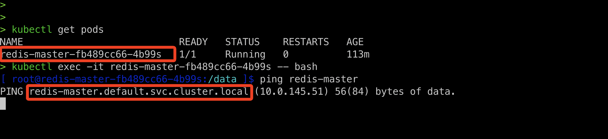

In this section, you exposed the Redis master using a service. This ensures that even if a pod moves to a different host, it can be reached through the service's IP address. In the next section, you will deploy the Redis replicas, which help to handle more read traffic.

In the next chapter, we will take an in-depth look at different deployment options to deploy applications onto AKS.

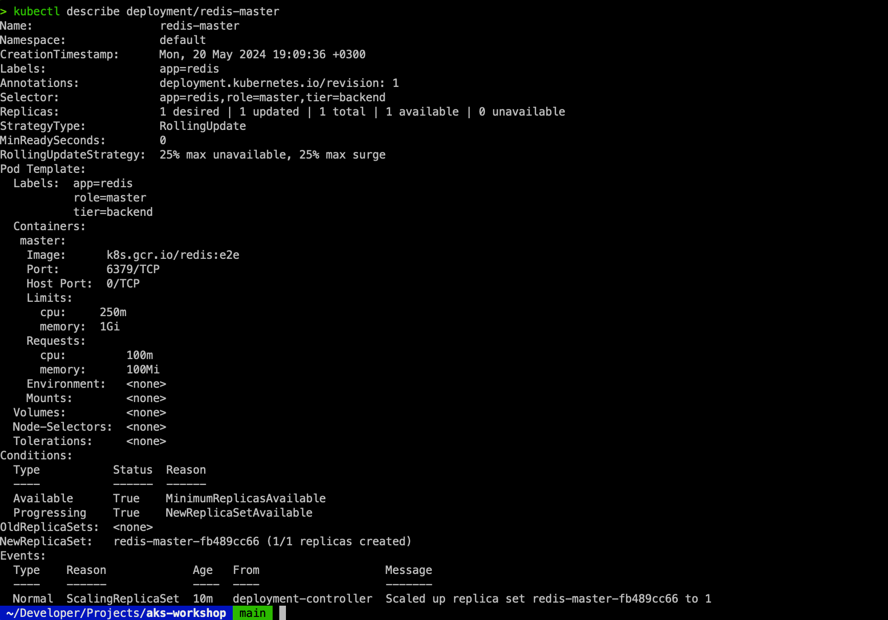

You have now launched a Redis master with the default configuration. Typically, you would launch an application with an environment-specific configuration.


## Deploying the Redis replicas
Running a single back end on the cloud is not recommended. You can configure Redis in a leader-follower (master-slave) setup. This means that you can have a master that will serve write traffic and multiple replicas that can handle read traffic. It is useful for handling increased read traffic and high availability.

Let's set this up:

Create the deployment by running the following command:
```
kubectl apply -f 04redis-replica-deployment.yaml
```
Let's check all the resources that have been created now:
```
kubectl get all
```
The output would be as shown below...


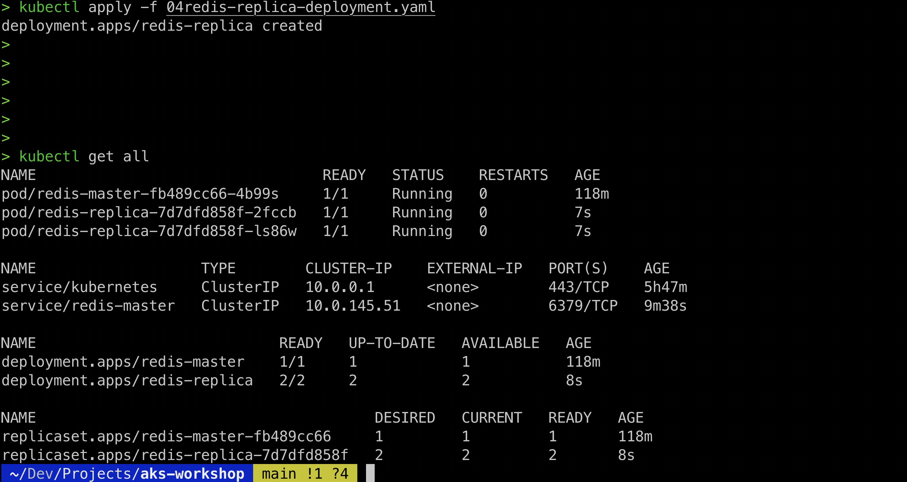


Based on the preceding output, you can see that you created two replicas of the redis-replica pods. This can be confirmed by examining the redis-replica- deployment.yaml file:
1   apiVersion: apps/v1
2   kind: Deployment
3   metadata:
4     name: redis-replica
5     labels:
6       app: redis
7   spec:
8     selector:
9       matchLabels:
10       app: redis
11       role: replica
12       tier: backend
13   replicas: 2
14   template:
15     metadata:
16       labels:
17         app: redis
18         role: replica
19         tier: backend
20     spec:
21       containers:
22       - name: replica
23         image: gcr.io/google-samples/gb-redis-follower:v1 24         resources:
25           requests:
26             cpu: 100m
27             memory: 100Mi
28         env:
29         - name: GET_HOSTS_FROM
30           value: dns
31         ports:
32         - containerPort: 6379
Everything is the same except for the following:
Line 13: The number of replicas is 2.
Line 23: You are now using a specific replica (follower) image.
Lines 29-30: Setting GET_HOSTS_FROM to dns. This is a setting that specifies that Redis should get the hostname of the master using DNS.
As you can see, this is similar to the Redis master you created earlier.
Like the master service, you need to expose the replica service by running the following:
```
kubectl apply -f 04redis-replica-service.yaml
```
The only difference between this service and the redis-master service is that this service proxies traffic to pods that have the role:replica label.
Check the redis-replica service by running the following command:
```
kubectl get service
```

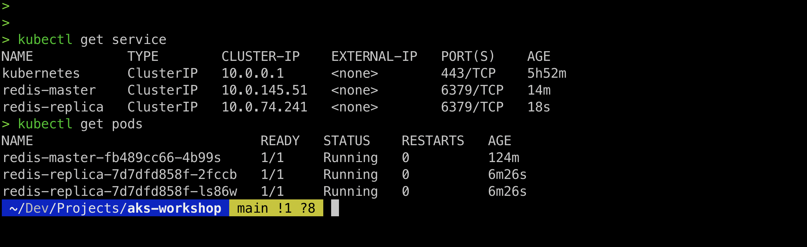

You now have a Redis cluster up and running, with a single master and two replicas. In the next section, you will deploy and expose the front end.


## Deploying and exposing the front end

Up to now, you have focused on the Redis back end. Now you are ready to deploy the front end. This will add a graphical web page to your application that you'll be able to interact with.

You can create the front end using the following command:

```
kubectl apply -f 04frontend-deployment.yaml
```

To verify the deployment, run this command:
```
kubectl get pods
```
This will display the output shown in Figure 3.13:

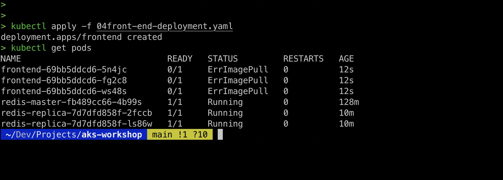

You will notice that this deployment specifies 3 replicas. The deployment has the usual aspects with minor changes, as shown in the following code:

1  apiVersion: apps/v1

2   kind: Deployment

3   metadata:

4     name: frontend

5     labels:

6       app: guestbook

7   spec:

8     selector:

9       matchLabels:

10        app: guestbook

11        tier: frontend

12    replicas: 3

13    template:

14      metadata:

15        labels:

16          app: guestbook

17          tier: frontend

18      spec:

19        containers:

20        - name: php-redis

21          image: gcr.io/google-samples/gb-frontend:v4

22          resources:

23            requests:

24              cpu: 100m

25              memory: 100Mi

26          env:

27          - name: GET_HOSTS_FROM

28            value: env

29          - name: REDIS_SLAVE_SERVICE_HOST

30            value: redis-replica

31          ports:

32          - containerPort: 80

Let's see these changes:

Line 11: The replica count is set to 3.

Line 8-10 and 14-16: The labels are set to app: guestbook and tier: frontend.

Line 20: gb-frontend:v4 is used as the image.
You have now created the front-end deployment. You now need to expose it as a service.

## Exposing the front-end service 

There are multiple ways to define a Kubernetes service. The two Redis services we created were of the type ClusterIP. This means they are exposed on an IP that is reachable only from the cluster.

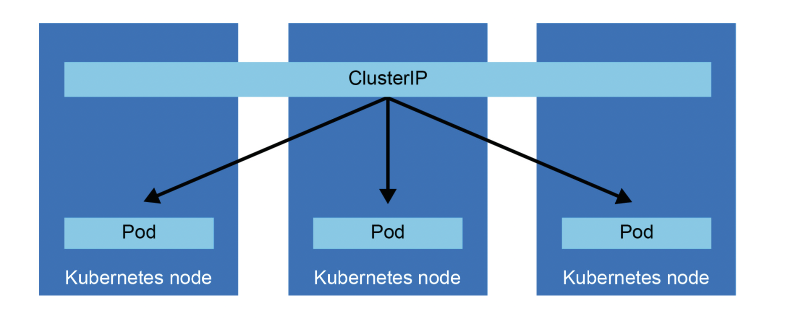

Another type of service is the type NodePort. A service of type NodePort is accessible from outside the cluster, by connecting to the IP of a node and the specified port.

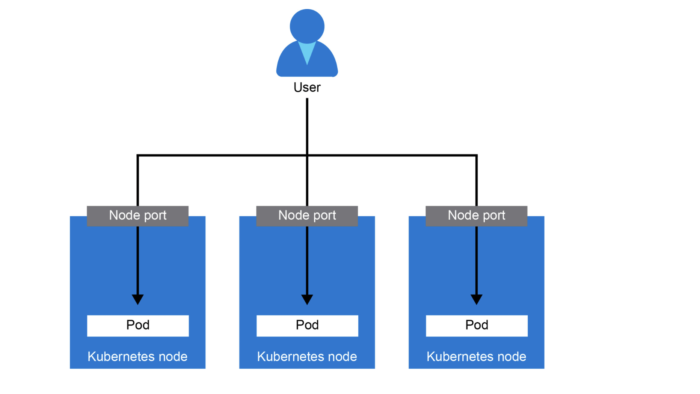

A final type – which will be used in this example – is the LoadBalancer type. This will create an Azure Load Balancer that will get a public IP that you can use to connect to.

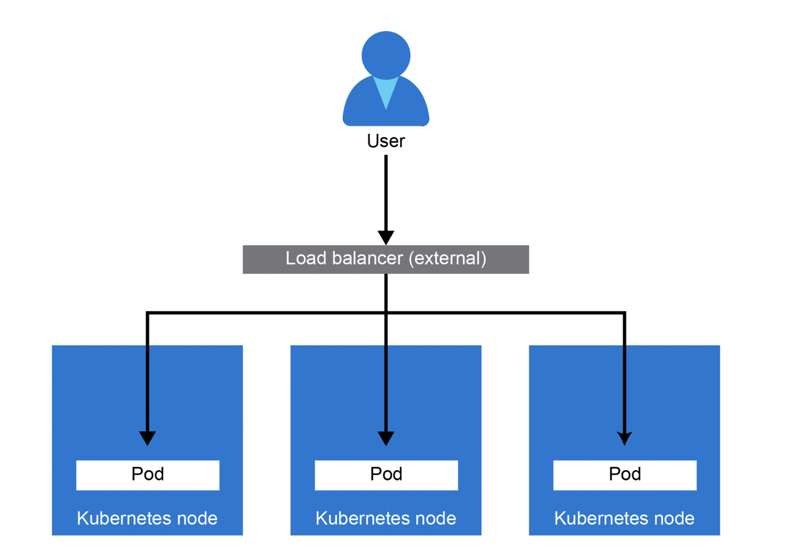

The following code will help you to understand how the frontend service is exposed:

1   apiVersion: v1

2   kind: Service

3   metadata:

4     name: frontend

5     labels:

6       app: guestbook

7       tier: frontend

8   spec:

9     type: LoadBalancer # line uncommented

10    ports:

11    - port: 80

12    selector:

13      app: guestbook

14      tier: frontend

This definition is similar to the services you created earlier, except that in line 9 you defined type: Load Balancer. This will create a service of that type, which will cause AKS to add rules to the Azure load balancer.

Now that you have seen how a front-end service is exposed, let's make the guestbook application ready for use with the following steps:

To create the service, run the following command:
```
kubectl create -f 04frontend-service.yaml
```
This step takes some time to execute when you run it for the first time. In the background, Azure must perform a couple of actions to make it seamless. It has to create an Azure load balancer and a public IP and set the port-forwarding rules to forward traffic on port 80 to internal ports of the cluster.
Run the following until there is a value in the EXTERNAL-IP column:

```
kubectl get service -w
```

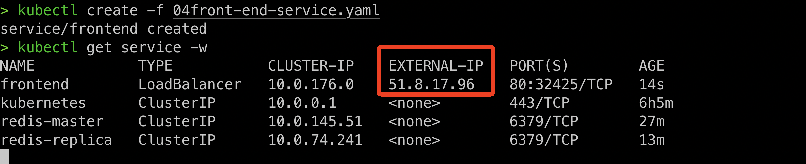

Confirm the configuration in the portal as below...
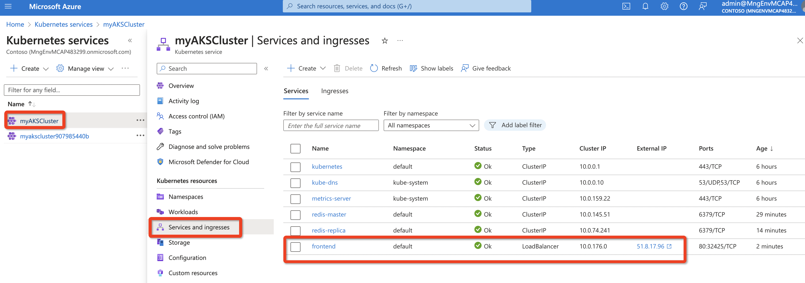

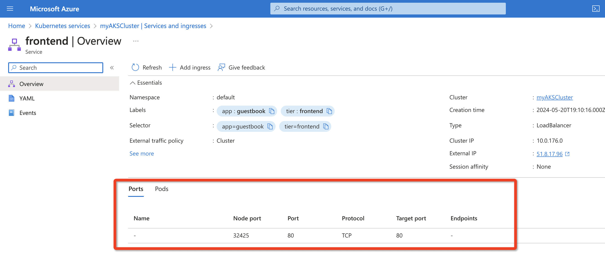

## The guestbook application in action

Type the public IP of the service in your favorite browser. 

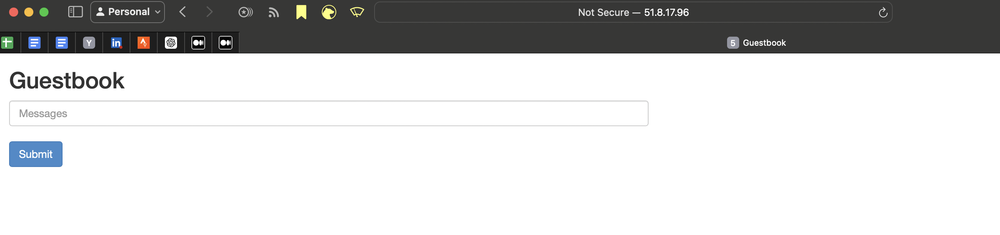

Go ahead and record your messages. They will be saved. Open another browser and type the same IP; you will see all the messages you typed.

# Congratulations – you have completed your first fully deployed, multi-tier, cloud-native Kubernetes application!


To conserve resources on your free-trial virtual machines, it is better to delete the created deployments to run the next round of the deployments by using the following commands:
```
kubectl delete deployment frontend redis-master redis-replica

kubectl delete service frontend redis-master redis-replica
```

Over the course of the preceding sections, you have deployed a Redis cluster and deployed a publicly accessible web application. You have learned how deployments, ReplicaSets, and pods are linked, and you have learned how Kubernetes uses the service object to route network traffic. In the next section of this chapter, you will use Helm to deploy a more complex application on top of Kubernetes.

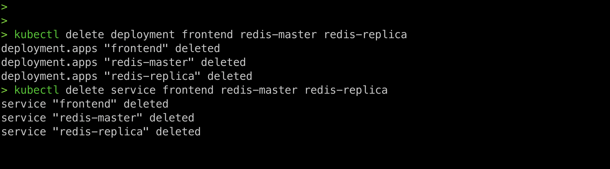

# Installing complex Kubernetes applications using Helm

Helm in Kubernetes Context
Helm is a package manager for Kubernetes, often referred to as the "Kubernetes equivalent of apt for Debian or yum for RedHat". It simplifies the deployment and management of applications on Kubernetes by allowing you to define, install, and upgrade even the most complex Kubernetes applications. Helm uses a packaging format called charts, which are collections of files that describe a related set of Kubernetes resources.

Why Helm is Necessary

**Simplifies Deployment:** \
Helm streamlines the process of deploying applications on Kubernetes. Instead of manually creating and managing multiple YAML files, you can use Helm charts to bundle your Kubernetes manifests into a single package, which can be easily installed and managed.

**Versioning and Rollback:** \
Helm maintains a history of releases, allowing you to easily roll back to a previous version of a release. This feature is crucial for managing updates and ensuring stability in production environments.

**Reusability**: \
Helm charts are reusable across different environments and teams. Once a chart is created, it can be shared and reused, promoting consistency and reducing duplication of effort.

**Configuration Management**: \
Helm allows you to define values that can be overridden during deployment, making it easier to manage configurations for different environments (development, staging, production).

**Ecosystem and Community**: \
Helm has a large ecosystem of pre-built charts available in the Helm Hub and other repositories. These charts cover a wide range of applications and services, accelerating the development and deployment process.

# Installing WordPress using Helm

As mentioned in the introduction, Helm has a rich library of pre-written Helm Charts. To access this library, you'll have to add a repo to your Helm client:

1. Add the repo that contains the stable Helm Charts using the following command:
```
helm repo add bitnami \
 https://charts.bitnami.com/bitnami
```
2. To install WordPress, run the following command:
```
helm install handsonakswp bitnami/wordpress
```
This execution will cause Helm to install the chart detailed at https://github.com/bitnami/charts/tree/master/bitnami/wordpress.
It takes some time for Helm to install and the site to come up. Let's look at a key concept, PersistentVolumeClaims, while the site is loading. After covering this, we'll go back and look at your site that got created.

## PersistentVolumeClaims

A typical process requires compute, memory, network, and storage. In the guestbook example, we saw how Kubernetes helps us abstract the compute, memory, and network. The same YAML files work across all cloud providers, including a cloud-specific setup of public-facing load balancers. The WordPress example shows how the last piece, namely storage, is abstracted from the underlying cloud provider.

In this case, the WordPress Helm Chart depends on the MariaDB helm chart (https://github.com/bitnami/charts/tree/master/bitnami/mariadb) for its database installation.

Unlike stateless applications, such as our front ends, MariaDB requires careful handling of storage. To make Kubernetes handle stateful workloads, it has a specific object called a StatefulSet. A StatefulSet (https://kubernetes.io/docs/concepts/workloads/controllers/statefulset/) is like a deployment with the additional capability of ordering, and the uniqueness of the pods. This means that Kubernetes will ensure that the pod and its storage are kept together. Another way that StatefulSets help is with the consistent naming of pods in a StatefulSet. The pods are named <pod-name>-#, where # starts from 0 for the first pod, and 1 for the second pod.

Running the following command, you can see that MariaDB has a predictable number attached to it, whereas the WordPress deployment has a random number attached to the end:


The numbering reinforces the ephemeral nature of the deployment pods versus the StatefulSet pods.

Another difference is how pod deletion is handled. When a deployment pod is deleted, Kubernetes will launch it again anywhere it can, whereas when a StatefulSet pod is deleted, Kubernetes will relaunch it only on the node it was running on. It will relocate the pod only if the node is removed from the Kubernetes cluster.

Often, you will want to attach storage to a StatefulSet. To achieve this, a StatefulSet requires a PersistentVolume (PV). This volume can be backed by many mechanisms (including blocks, such as Azure Blob, EBS, and iSCSI, and network filesystems, such as AFS, NFS, and GlusterFS). StatefulSets require either a pre-provisioned volume or a dynamically provisioned volume handled by a PersistentVolumeClaim (PVC). A PVC allows a user to dynamically request storage, which will result in a PV being created.

Please refer to https://kubernetes.io/docs/concepts/storage/persistent-volumes/ for more detailed information.

In this WordPress example, you are using a PVC. A PVC provides an abstraction over the underlying storage mechanism. Let's look at what the MariaDB Helm Chart did by running the following:

```
kubectl get statefulset -o yaml > mariadbss.yaml

code mariadbss.yaml
```

In the preceding command, you got the YAML definition of the StatefulSet that was created and stored it in a file called mariadbss.yaml. Let's look at the most relevant parts of that YAML file. The code has been truncated to only show the most relevant parts:

1   apiVersion: v1

2   items:

3   - apiVersion: apps/v1

4     kind: StatefulSet

...

285           volumeMounts:

286           - mountPath: /bitnami/mariadb

287             name: data

...           

306 volumeClaimTemplates:

307 - apiVersion: v1

308   kind: PersistentVolumeClaim

309   metadata:

310     creationTimestamp: null

311     labels:

312       app.kubernetes.io/component: primary

313       app.kubernetes.io/instance: handsonakswp

314       app.kubernetes.io/name: mariadb

315     name: data

316   spec:

317     accessModes:

318     - ReadWriteOnce

319     resources:

320       requests:

321         storage: 8Gi

322     volumeMode: Filesystem

...

Most of the elements of the preceding code have been covered earlier in the deployment. In the following points, we will highlight the key differences, to take a look at just the PVC:

Note

PVC can be used by any pod, not just StatefulSet pods.

Let's discuss the different elements of the preceding code in detail:

Line 4: This line indicates the StatefulSet declaration.
Lines 285-287: These lines mount the volume defined as data and mount it under the /bitnami/mariadb path.
Lines 306-322: These lines declare the PVC. Note specifically:
Line 315: This line gives it the name data, which is reused at line 285.
Line 318: This line gives the access mode ReadWriteOnce, which will create block storage, which on Azure is a disk. There are other access modes as well, namely ReadOnlyMany and ReadWriteMany. As the name suggests, a ReadWriteOnce volume can only be attached to a single pod, while a ReadOnlyMany or ReadWriteMany volume can be attached to multiple pods at the same time. These last two types require a different underlying storage mechanism such as Azure Files or Azure Blob.
Line 321: This line defines the size of the disk.
Based on the preceding information, Kubernetes dynamically requests and binds an 8 GiB volume to this pod. In this case, the default dynamic-storage provisioner backed by the Azure disk is used. The dynamic provisioner was set up by Azure when you created the cluster. To see the storage classes available on your cluster, you can run the following command:

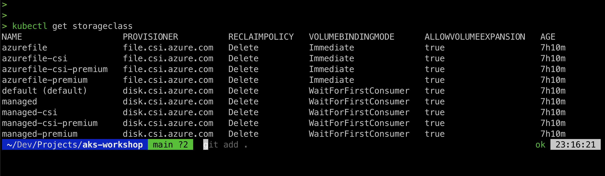

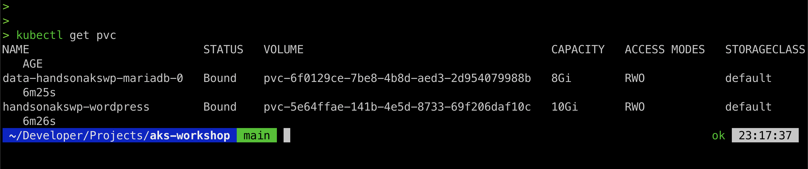

When we asked for storage in the StatefulSet description (lines 128-143), Kubernetes performed Azure-disk-specific operations to get the Azure disk with 8 GiB of storage. If you copy the name of the PVC and paste that in the Azure search bar, you should find the disk that was created:

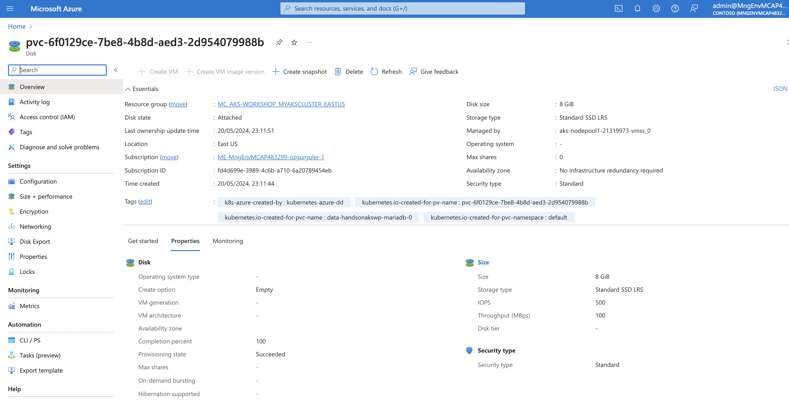

The concept of a PVC abstracts cloud provider storage specifics. This allows the same Helm template to work across Azure, AWS, or GCP. On AWS, it will be backed by Elastic Block Store (EBS), and on GCP it will be backed by Persistent Disk.

Also, note that PVCs can be deployed without using Helm.

In this section, the concept of storage in Kubernetes using PersistentVolumeClaim (PVC) was introduced. You saw how they were created by the WordPress Helm deployment, and how Kubernetes created an Azure disk to support the PVC used by MariaDB. In the next section, you will explore the WordPress application on Kubernetes in more detail.

## Checking the WordPress deployment

After our analysis of the PVCs, let's check back in with the Helm deployment. You can check the status of the deployment using:


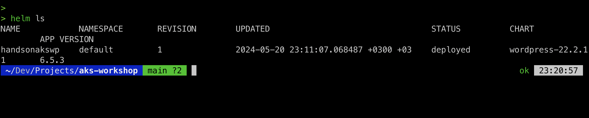

We can get more info from our deployment in Helm using the following command:

```
helm status handsonakswp
```

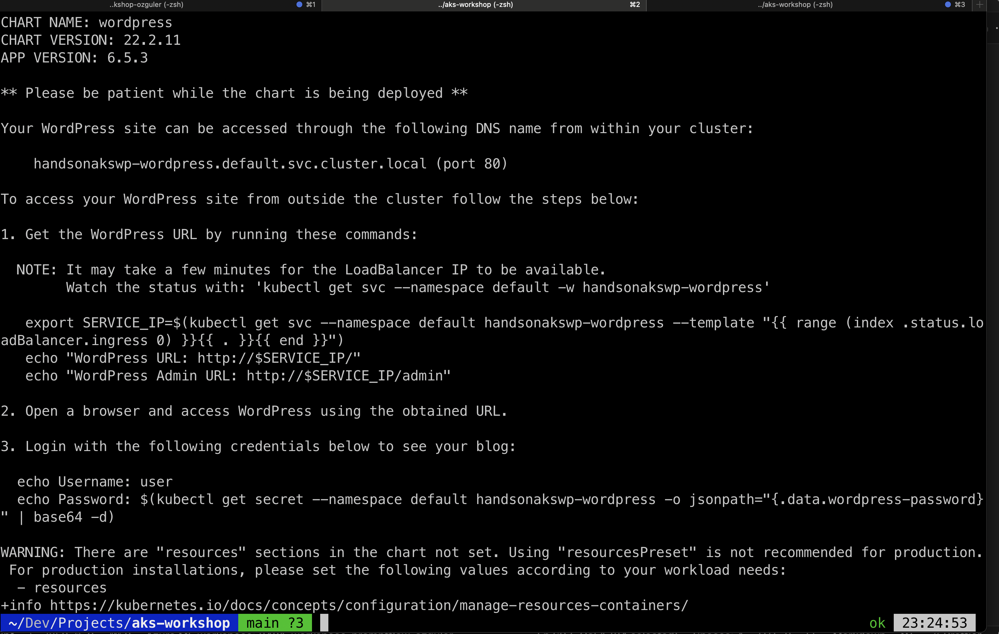

Get the external IP address...
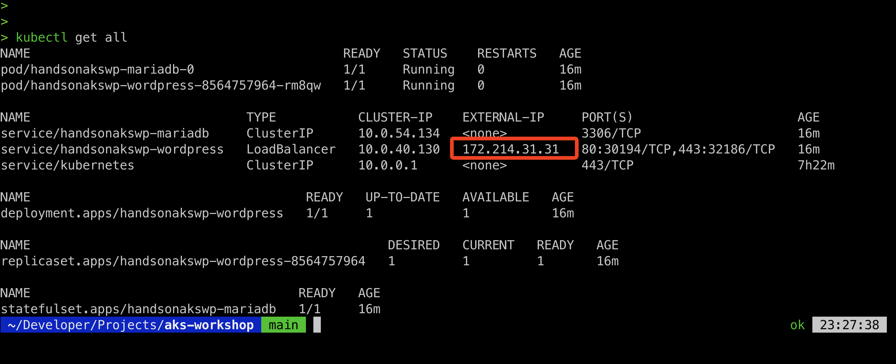

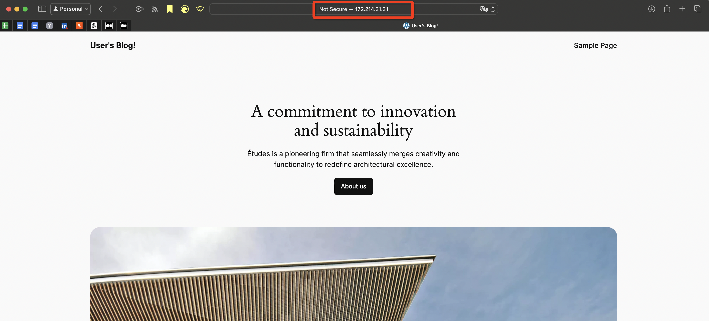

To make sure you don't run into issues in the following chapters, let's delete the WordPress site. This can be done in the following way:

```
helm delete handsonakswp
```

By design, the PVCs won't be deleted. This ensures persistent data is kept. As you don't have any persistent data, you can safely delete the PVCs as well:

```
kubectl delete pvc --all
```


In this section, you have deployed a full WordPress site using Helm. You also learned how Kubernetes handles persistent storage using PVCs.

WARNING!!!
*Running databases on Kubernetes can be done and offers benefits such as portability, scalability, and declarative configuration, but it also comes with challenges. Kubernetes is designed for stateless applications, and managing stateful applications like databases introduces complexity due to persistent storage, data consistency, and backup concerns. While deploying databases via Helm charts, such as installing WordPress with a bundled database using Bitnami's Helm repository, is straightforward and suitable for development and testing environments, production use requires careful evaluation. Ensuring reliable persistent storage, high availability, and robust backup strategies is crucial. For production environments, consider alternatives like managed database services from cloud providers or a hybrid approach that combines Kubernetes for the application layer with external managed databases to balance operational complexity and performance needs.*
