# 5. Building scalable applications

Running an application efficiently requires the ability to scale and upgrade it as needed. Scaling ensures that your application can handle increased loads, while upgrading allows you to introduce new features and keep the application up to date. Scaling on demand is a key advantage of cloud-native applications, optimizing resource usage according to the current workload.

For instance, if the front-end component of your application faces heavy traffic, you can scale just the front end while maintaining the same number of back-end instances. This flexibility allows you to adjust the number of virtual machines (VMs) based on workload demands and peak usage times. This chapter will explore the dimensions of scaling your application and its infrastructure in detail.

You will learn to scale the sample guestbook application introduced in Lab4, Application Deployment on AKS. Initially, you'll use manual commands to scale the application and later implement autoscaling with the Horizontal Pod Autoscaler (HPA). The aim is to familiarize you with kubectl, an essential tool for managing applications on Azure Kubernetes Service (AKS). After scaling the application, you'll also scale the cluster manually and then using the cluster autoscaler. Additionally, you'll get a brief introduction to upgrading applications on AKS.

**Cluster Autoscaler in Azure** \
The Cluster Autoscaler in Azure Kubernetes Service (AKS) automatically adjusts the number of nodes in a cluster based on the current resource requirements. It helps ensure that your cluster has enough nodes to run your workloads while optimizing resource usage and costs.

**How Cluster Autoscaler Works:**

**Monitoring:**\
The autoscaler continuously monitors the resources required by the pods in the cluster. It checks for any pending pods that cannot be scheduled due to insufficient resources.

**Scaling Up:**\
When the autoscaler detects that there are unschedulable pods due to resource constraints, it adds more nodes to the cluster to accommodate these pods.

**Scaling Down:**\
If the autoscaler finds that certain nodes have low utilization and the pods running on them can be rescheduled onto other nodes, it removes these underutilized nodes from the cluster. This helps reduce costs by not running unnecessary nodes.

**Integration with Node Pools:**\
In AKS, the autoscaler can work with multiple node pools. This allows different scaling policies for different types of workloads, providing more fine-grained control over the scaling behavior.

In this lab, we will cover the following topics:

- Scaling your application
- Scaling your cluster
- Upgrading your application
- Let's begin this chapter by discussing the different dimensions of scaling applications on top of AKS.

## **Scaling your application**

There are two scale dimensions for applications running on top of AKS. The first scale dimension is the number of pods a deployment has, while the second scale dimension in AKS is the number of nodes in the cluster.

By adding new pods to a deployment, also known as scaling out, you can add additional compute power to the deployed application. You can either scale out your applications manually or have Kubernetes take care of this automatically via HPA. HPA can monitor metrics such as the CPU to determine whether pods need to be added to your deployment.

The second scale dimension in AKS is the number of nodes in the cluster. The number of nodes in a cluster defines how much CPU and memory are available for all the applications running on that cluster. You can scale your cluster manually by changing the number of nodes, or you can use the cluster autoscaler to automatically scale out your cluster. The cluster autoscaler watches the cluster for pods that cannot be scheduled due to resource constraints. If pods cannot be scheduled, it will add nodes to the cluster to ensure that your applications can run.

Both scale dimensions will be covered in this lab. In this section, you will learn how you can scale your application. First, you will scale your application manually, and then later, you will scale your application automatically.

```
kubectl create -f 05guestbook-all-in-one.yaml
```
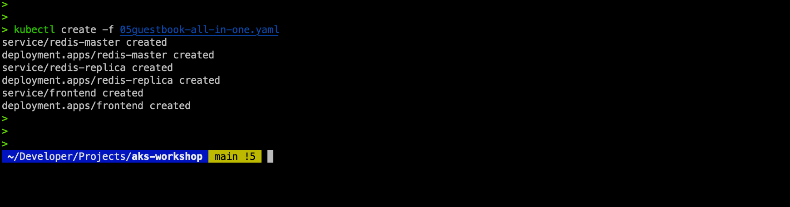

Confirm the services are not created yet...
```
kubectl get service
```


To test the application, you will need to expose it publicly. For this, let's introduce a new command that will allow you to edit the service in Kubernetes without having to change the file on your file system. To start the edit, execute the following command:

```
kubectl edit service frontend
```

Change the service type to LoadBalancer. (Note the capital "B" in LoadBalancer.)
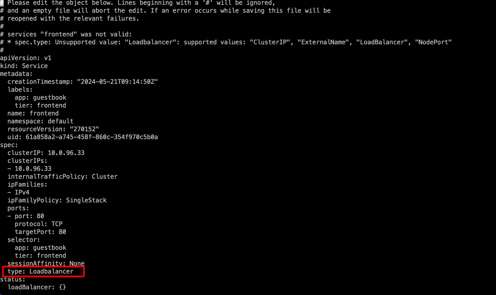

Once done, check the service until a public IP is assigned to the service with...
```
kubectl get service -w
```
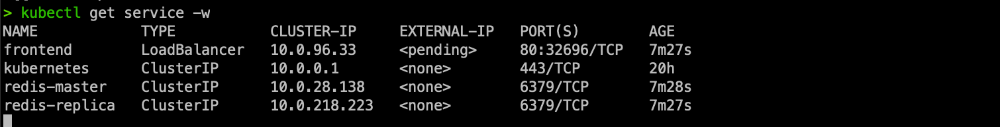

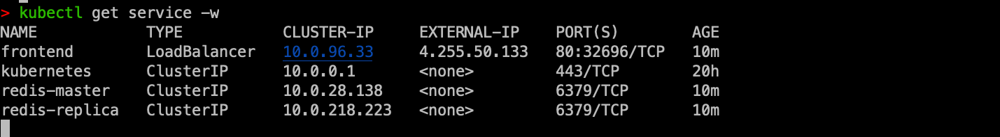

Type the external IP address in the browser to access the Guestbook app...

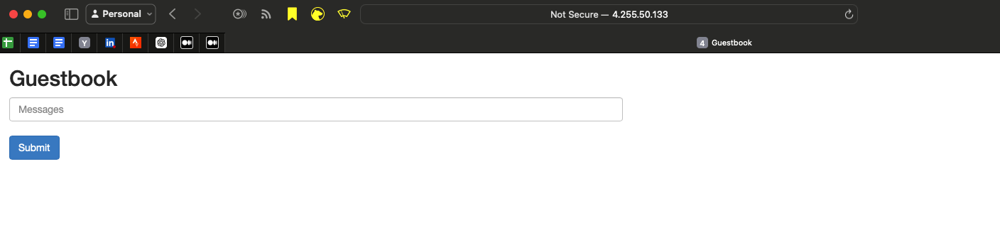

## Scaling the guestbook front-end component

Kubernetes gives us the ability to scale each component of an application dynamically. In this section, we will show you how to scale the front end of the guestbook application. Right now, the front-end deployment is deployed with three replicas. You can confirm by using the following command:

To scale the front-end deployment, you can execute the following command:
```
kubectl scale deployment/frontend --replicas=6
```
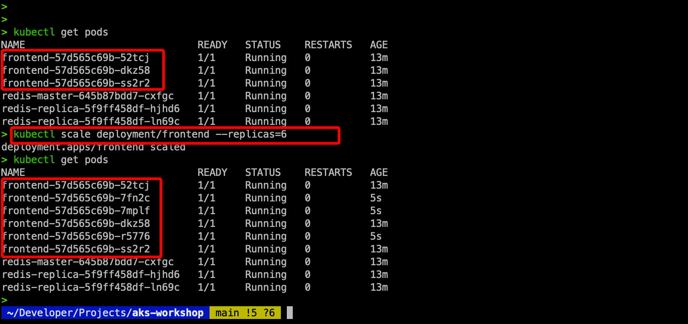

This will cause Kubernetes to add additional pods to the deployment. You can set the number of replicas you want, and Kubernetes takes care of the rest. You can even scale it down to zero (one of the tricks used to reload the configuration when the application doesn't support the dynamic reload of configuration).


As you can see, the front-end service scaled to six pods. Kubernetes also spread these pods across multiple nodes in the cluster. You can see the nodes that this is running on with the following command...

```
kubectl get pods -o wide
```
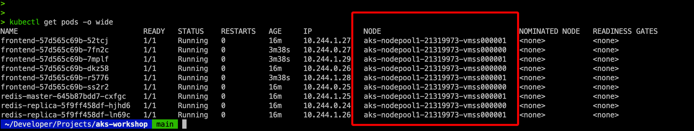

In this section, you have seen how easy it is to scale pods with Kubernetes. This capability provides a very powerful tool for you to not only dynamically adjust your application components but also provide resilient applications with failover capabilities enabled by running multiple instances of components at the same time. However, you won't always want to manually scale your application. In the next section, you will learn how you can automatically scale your application in and out by automatically adding and removing pods in a deployment.

## Using the HPA

Scaling manually is useful when you're working on your cluster. For example, if you know your load is going to increase, you can manually scale out your application. In most cases, however, you will want some sort of autoscaling to happen on your application. In Kubernetes, you can configure autoscaling of your deployment using an object called the Horizontal Pod Autoscaler (HPA).

HPA monitors Kubernetes metrics at regular intervals and, based on the rules you define, it automatically scales your deployment. For example, you can configure the HPA to add additional pods to your deployment once the CPU utilization of your application is above 50%.

In this section, you will configure the HPA to scale the front-end of the application automatically:

Let's first scale down the front-end deployment with...
```
kubectl scale deployment/frontend --replicas=1
```

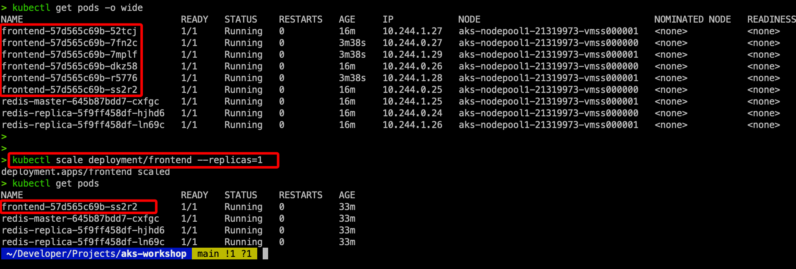

Now first create our hpa.yaml...

```yaml
apiVersion: autoscaling/v1
kind: HorizontalPodAutoscaler
metadata:
  name: frontend-scaler
spec:
  scaleTargetRef:
    apiVersion: apps/v1
    kind: Deployment
    name: frontend
  minReplicas: 1
  maxReplicas: 10
  targetCPUUtilizationPercentage: 50
```

Let's investigate what is configured in this file: \
Line 2: Here, we define that we need HorizontalPodAutoscaler.\
Lines 6-9: These lines define the deployment that we want to autoscale.\
Lines 10-11: Here, we configure the minimum and maximum pods in our deployment.\
Lines 12: Here, we define the target CPU utilization percentage for our deployment.

Save this file, and create the HPA using the following command:
```
kubectl create -f hpa.yaml
```

Wait until the HPA gets ready...\
Once the target shows a percentage, the HPA is ready
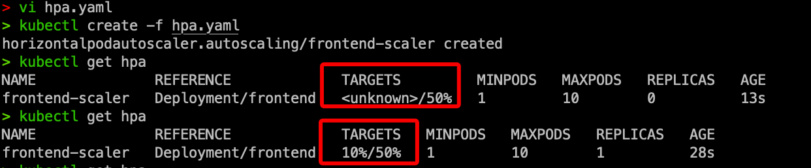

Now once our HPA is ready, we can move on with the next step...\
Next, we will generate load for our cluster with a load generator.

We will use a program called "hey" to generate this load. hey is a tiny program that sends loads to a web application. 

Installing hey to CloudShell is recommended. \
First launch a new CloudShell in the portal.
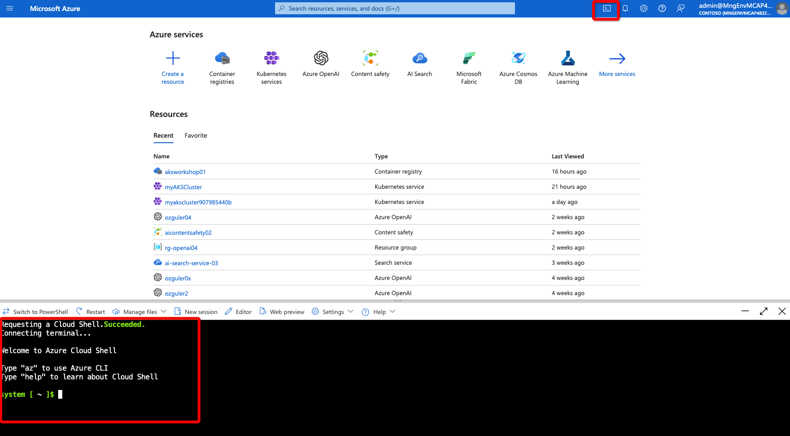


```
export GOPATH=~/go
export PATH=$GOPATH/bin:$PATH
go install github.com/rakyll/hey@latest
hey -z 20m http://<external-ip>
```
The hey program will now try to create up to 20 million connections to the front-end. This will generate CPU loads on the system, which will trigger the HPA to start scaling the deployment. It will take a couple of minutes for this to trigger a scale action, but at a certain point, you should see multiple pods being created to handle the additional load, 

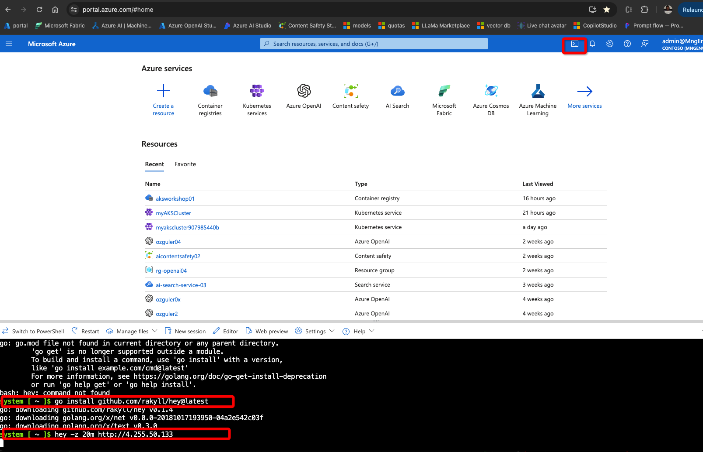
Check and confirm your pods scaled up as expected...

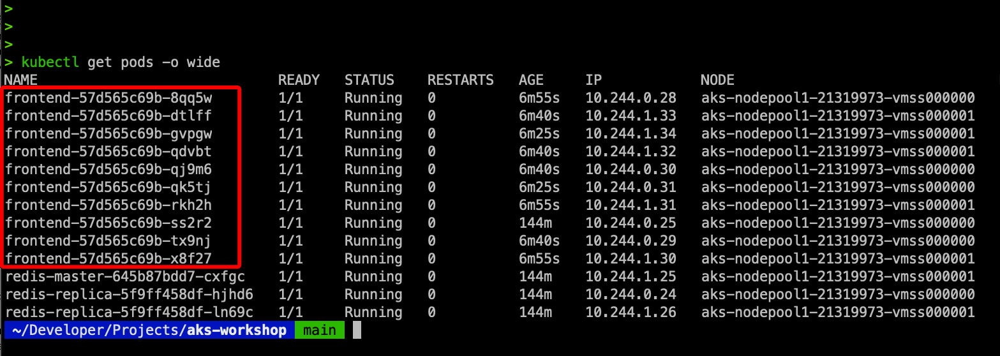

Let's have a closer look at what the HPA did by running the following command:
```
kubectl describe hpa
```

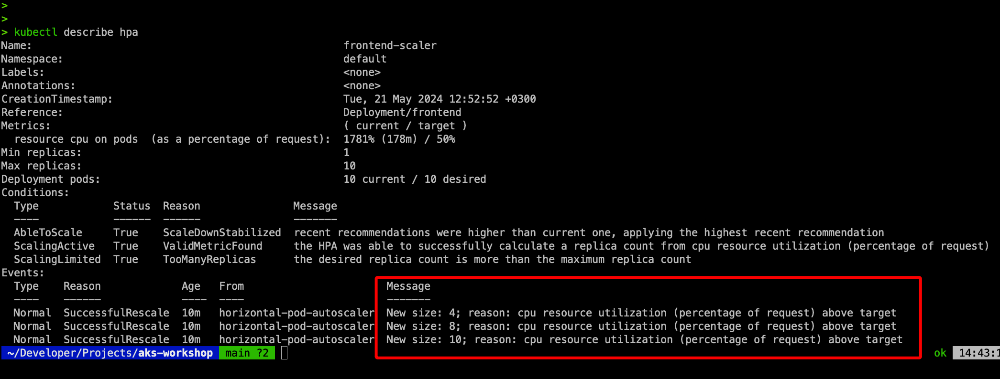

1. "metrics - resource cpu on pod" This shows you the current CPU utilization (1781%) versus the desired (50%). The current CPU utilization will likely be different in your situation.
2. "Too many replicas" This shows you that the current desired replica count is higher than the actual maximum you had configured. This ensures that a single deployment doesn't consume all resources in the cluster.
3. At the bottom marked with a red rectangle, shows you the scaling actions that the HPA took. It first scaled to 4, then to 8, and then to 10 pods in the deployment.


If you wait for a couple of minutes, the HPA should start to scale down. You can track this scale-down operation using the following command:
```
kubectl get hpa -w
```

Before we move on to the next section, let's clean up the resources we created in this section:
```
kubectl delete -f hpa.yaml
kubectl delete -f guestbook-all-in-one.yaml
```
In this section, you first manually and then automatically scaled an application. However, the infrastructure supporting the application was static; you ran this on a two-node cluster. In many cases, you might also run out of resources on the cluster. In the next section, you will deal with this issue and learn how you can scale the AKS cluster yourself.

## Scaling your cluster

In the previous section, you dealt with scaling the application running on top of a cluster. In this section, you'll learn how you can scale the actual cluster you are running. First, you will manually scale your cluster to one node. Then, you'll configure the cluster autoscaler. The cluster autoscaler will monitor your cluster and scale out when there are pods that cannot be scheduled on the cluster.

### Manually scaling your cluster

You can manually scale your AKS cluster by setting a static number of nodes for the cluster. The scaling of your cluster can be done either via the Azure portal or the command line.

In this section, you'll learn how you can manually scale your cluster by scaling it down to one node. This will cause Azure to remove one of the nodes from your cluster. First, the workload on the node that is about to be removed will be rescheduled onto the other node. Once the workload is safely rescheduled, the node will be removed from your cluster, and then the VM will be deleted from Azure.

Folow the below, UI actions and scale your node count to 1.

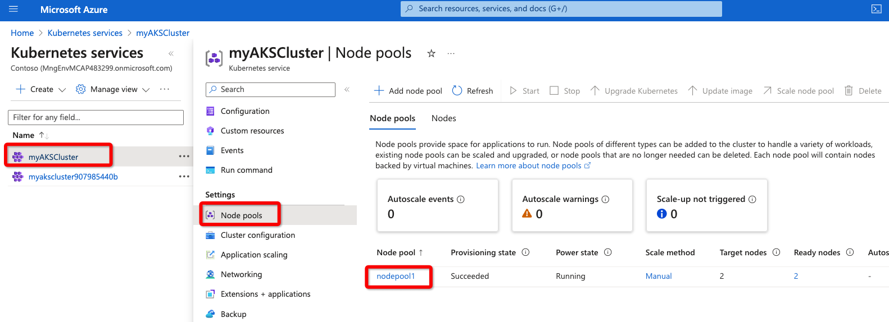
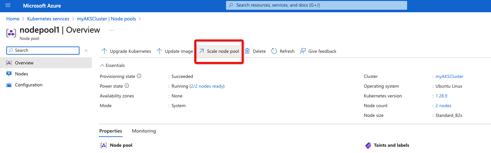

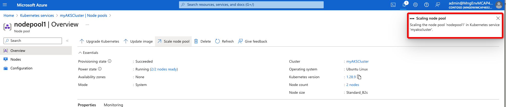

confirm the scale down event, with...
```
kubectl get nodes 
```
Confirm the number of nodes gets down to 1...
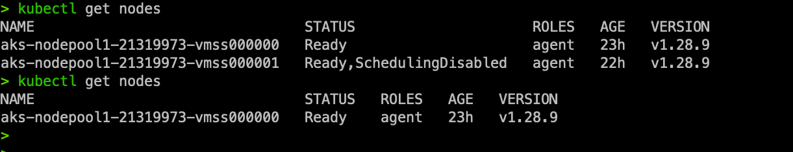

## Scaling your cluster using the "Cluster Autoscaler"

In this section, you will explore the cluster autoscaler. The cluster autoscaler will monitor the deployments in your cluster and scale your cluster to meet your application requirements. The cluster autoscaler watches the number of pods in your cluster that cannot be scheduled due to insufficient resources. You will first force your deployment to have pods that cannot be scheduled, and then configure the cluster autoscaler to automatically scale your cluster.

First deploy the app with "kubectl create -f".
To force your cluster to be out of resources, you will—manually—scale out the redis-replica  deployment. To do this, use the following command:

```
kubectl scale deployment redis-replica --replicas 5
```
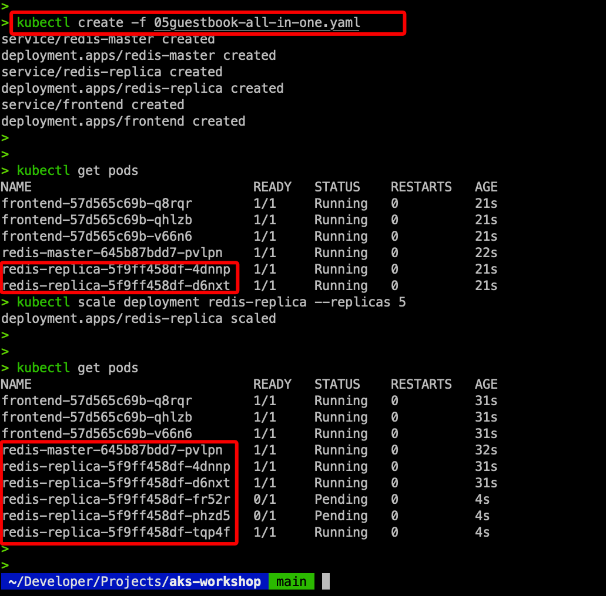

Two of the pods are in pending state.
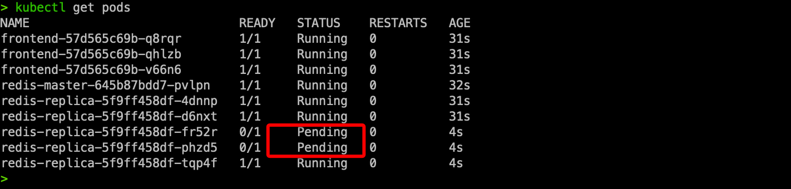

To get more details as to the nature of load nodes are going through you may use the following set of commands... 
```
kubectl get nodes 
kubectl describe node <node-name>
kubectl top nodes 
```

You will now configure the cluster autoscaler to automatically scale the cluster. Similar to manual scaling in the previous section, there are two ways you can configure the cluster autoscaler. You can configure it either via the Azure portal—similar to how we did the manual scaling—or you can configure it using the command-line interface (CLI). In this example, you will use CLI to enable the cluster autoscaler. The following command will configure the cluster autoscaler for your cluster:

```
az aks nodepool update \
  --resource-group aks-workshop \
  --cluster-name myAKSCluster \
  --name nodepool1 \
  --enable-cluster-autoscaler \
  --min-count 1 \
  --max-count 2

```
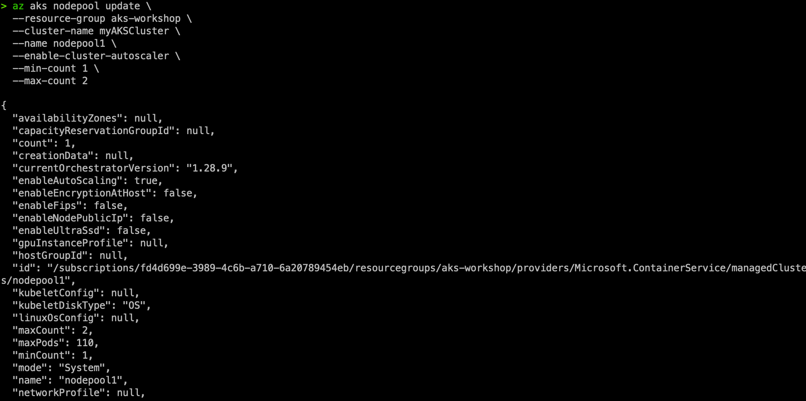

It will take about 5 minutes for the new node to show up and become Ready in the cluster. Once the new node is Ready, you can stop watching the nodes by hitting Ctrl + C.

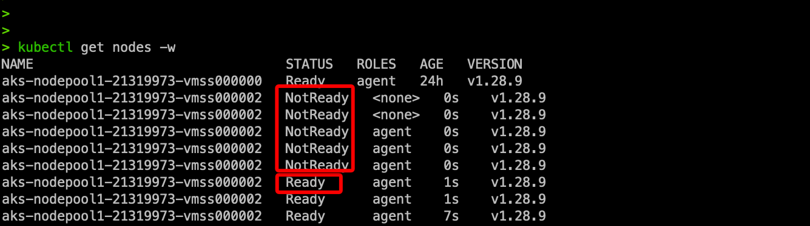

The new node should ensure that your cluster has sufficient resources to schedule the scaled-out redis- replica deployment. To verify this, run the following command to check the status of the pods:

Confirm with kubectl get pods...
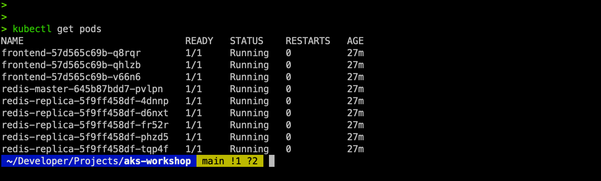

Now clean up the resources you created, disable the cluster autoscaler, and ensure that your cluster has two nodes for the next example. To do this, use the following commands:

```
kubectl delete -f guestbook-all-in-one.yaml

az aks nodepool update \
--resource-group aks-workshop \
--disable-cluster-autoscaler \
--cluster-name myAKSCluster \
--name nodepool1 

az aks nodepool scale \
--resource-group aks-workshop \
--node-count 2 \
--cluster-name myAKSCluster \
--name nodepool1
```

The last command from the previous example will show you an error message, The new node count is the same as the current node count., if the cluster already has two nodes. You can safely ignore this error.

In this section, you first manually scaled down your cluster and then used the cluster autoscaler to scale out your cluster. You used the Azure portal to scale down the cluster manually and then used the Azure CLI to configure the cluster autoscaler. In the next section, you will look into how you can upgrade applications running on AKS.

W

