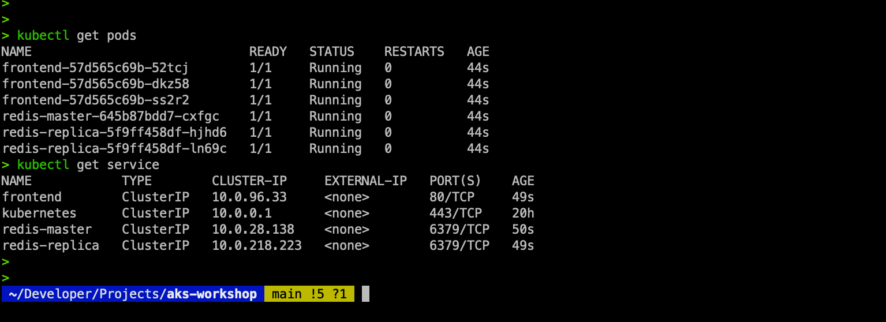

# 5. Building scalable applications

Running an application efficiently requires the ability to scale and upgrade it as needed. Scaling ensures that your application can handle increased loads, while upgrading allows you to introduce new features and keep the application up to date. Scaling on demand is a key advantage of cloud-native applications, optimizing resource usage according to the current workload.

For instance, if the front-end component of your application faces heavy traffic, you can scale just the front end while maintaining the same number of back-end instances. This flexibility allows you to adjust the number of virtual machines (VMs) based on workload demands and peak usage times. This chapter will explore the dimensions of scaling your application and its infrastructure in detail.

You will learn to scale the sample guestbook application introduced in Lab4, Application Deployment on AKS. Initially, you'll use manual commands to scale the application and later implement autoscaling with the Horizontal Pod Autoscaler (HPA). The aim is to familiarize you with kubectl, an essential tool for managing applications on Azure Kubernetes Service (AKS). After scaling the application, you'll also scale the cluster manually and then using the cluster autoscaler. Additionally, you'll get a brief introduction to upgrading applications on AKS.

**Cluster Autoscaler in Azure** \
The Cluster Autoscaler in Azure Kubernetes Service (AKS) automatically adjusts the number of nodes in a cluster based on the current resource requirements. It helps ensure that your cluster has enough nodes to run your workloads while optimizing resource usage and costs.

**How Cluster Autoscaler Works:**

**Monitoring:**\
The autoscaler continuously monitors the resources required by the pods in the cluster. It checks for any pending pods that cannot be scheduled due to insufficient resources.

**Scaling Up:**\
When the autoscaler detects that there are unschedulable pods due to resource constraints, it adds more nodes to the cluster to accommodate these pods.

**Scaling Down:**\
If the autoscaler finds that certain nodes have low utilization and the pods running on them can be rescheduled onto other nodes, it removes these underutilized nodes from the cluster. This helps reduce costs by not running unnecessary nodes.

**Integration with Node Pools:**\
In AKS, the autoscaler can work with multiple node pools. This allows different scaling policies for different types of workloads, providing more fine-grained control over the scaling behavior.

In this lab, we will cover the following topics:

- Scaling your application
- Scaling your cluster
- Upgrading your application
- Let's begin this chapter by discussing the different dimensions of scaling applications on top of AKS.

## **Scaling your application**

There are two scale dimensions for applications running on top of AKS. The first scale dimension is the number of pods a deployment has, while the second scale dimension in AKS is the number of nodes in the cluster.

By adding new pods to a deployment, also known as scaling out, you can add additional compute power to the deployed application. You can either scale out your applications manually or have Kubernetes take care of this automatically via HPA. HPA can monitor metrics such as the CPU to determine whether pods need to be added to your deployment.

The second scale dimension in AKS is the number of nodes in the cluster. The number of nodes in a cluster defines how much CPU and memory are available for all the applications running on that cluster. You can scale your cluster manually by changing the number of nodes, or you can use the cluster autoscaler to automatically scale out your cluster. The cluster autoscaler watches the cluster for pods that cannot be scheduled due to resource constraints. If pods cannot be scheduled, it will add nodes to the cluster to ensure that your applications can run.

Both scale dimensions will be covered in this lab. In this section, you will learn how you can scale your application. First, you will scale your application manually, and then later, you will scale your application automatically.

```
kubectl create -f 05guestbook-all-in-one.yaml
```


Confirm the services are not created yet...
```
kubectl get service
```



To test the application, you will need to expose it publicly. For this, let's introduce a new command that will allow you to edit the service in Kubernetes without having to change the file on your file system. To start the edit, execute the following command:

```
kubectl edit service frontend
```

Change the service type to LoadBalancer. (Note the capital "B" in LoadBalancer.)


Once done, check the service until a public IP is assigned to the service with...
```
kubectl get service -w
```
